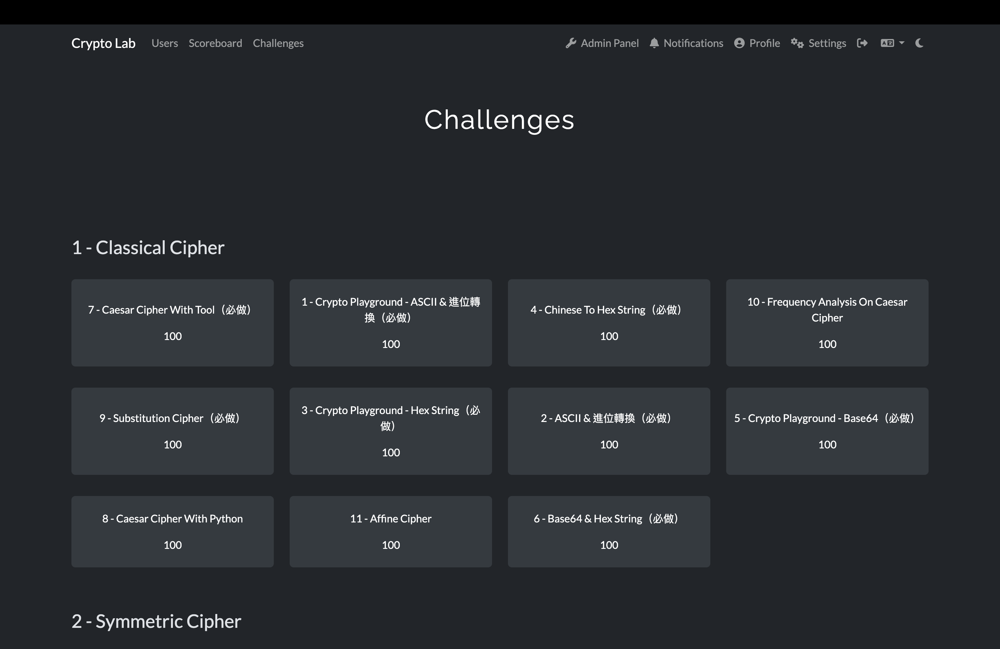
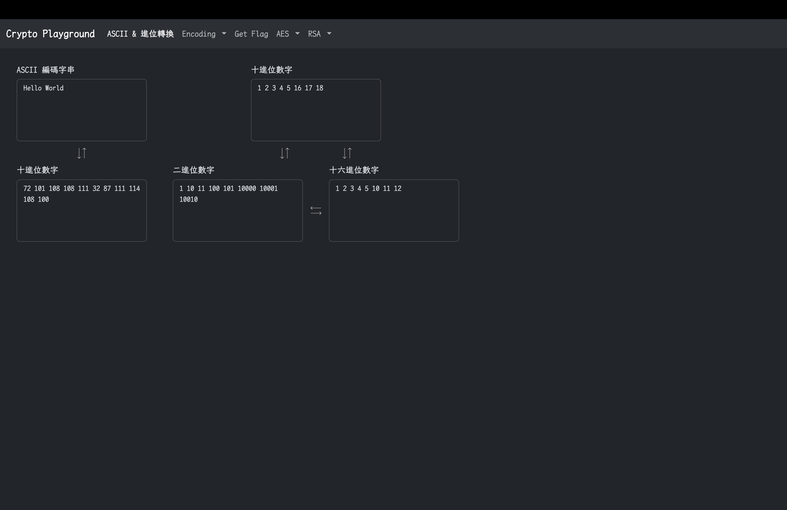
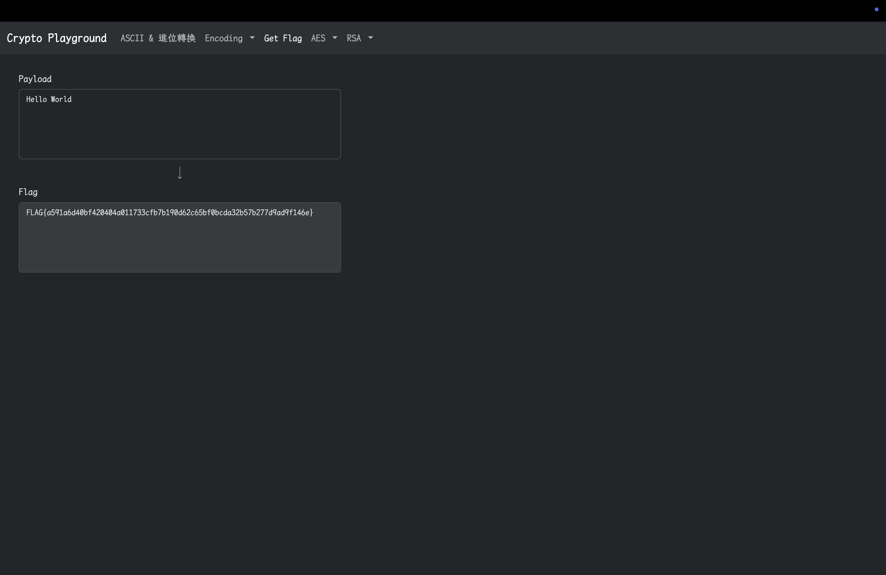
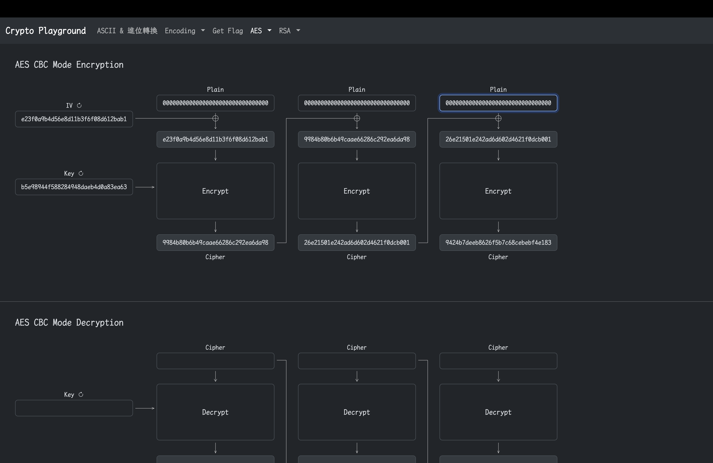
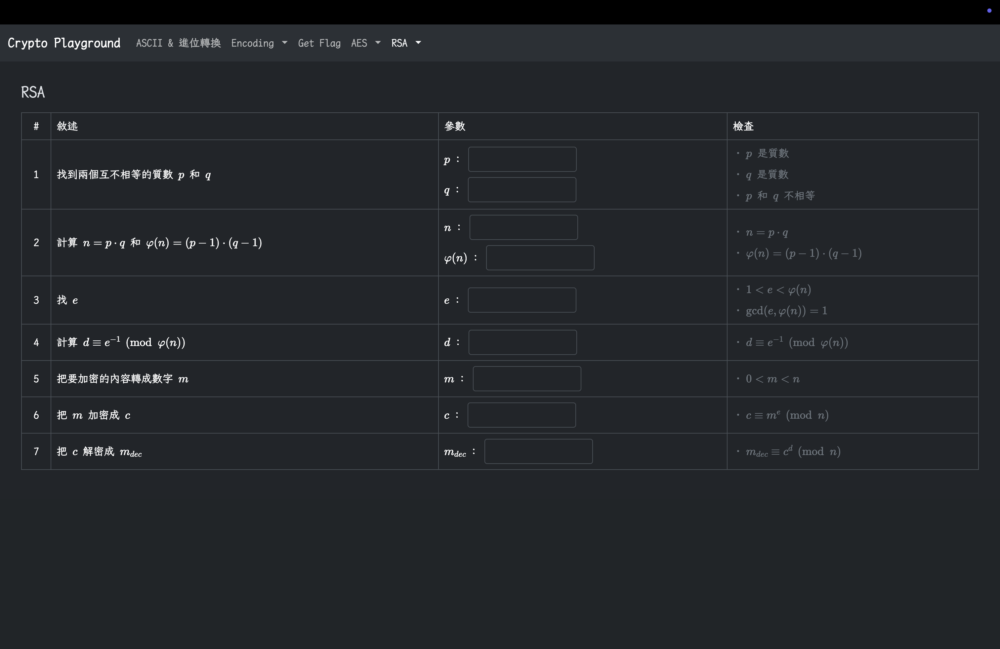
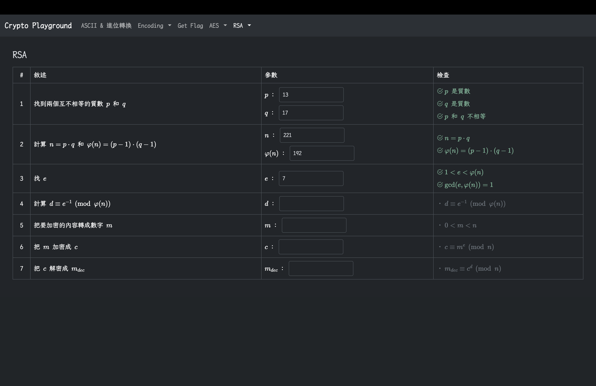
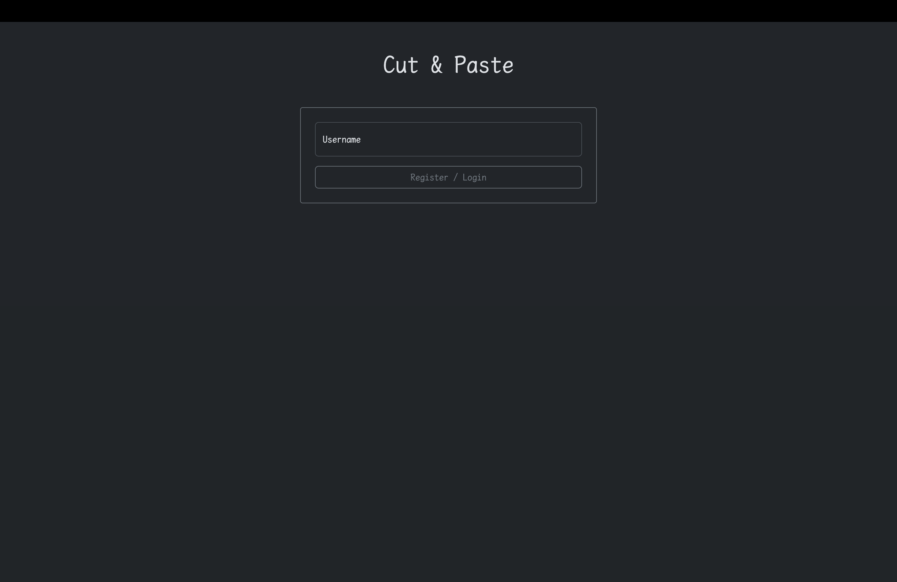

# Taiwan Holy Young 2024 - Crypto Lab

## Preview















---

## 解答

所有 Challenge 資料夾底下都有一個子資料夾叫做 `sol`，裡面有會該題的解答

---

## Prerequest

- Ubuntu 22.04 (or any version but can't guarantee it will work)

---

## Dependencies Installation

### Docker Installation

參考 [Docker Docs - Install Docker Engine on Ubuntu](https://docs.docker.com/engine/install/ubuntu/#install-using-the-repository)

執行

```bash
sudo apt-get update
sudo apt-get install ca-certificates curl
sudo install -m 0755 -d /etc/apt/keyrings
sudo curl -fsSL https://download.docker.com/linux/ubuntu/gpg -o /etc/apt/keyrings/docker.asc
sudo chmod a+r /etc/apt/keyrings/docker.asc
echo \
  "deb [arch=$(dpkg --print-architecture) signed-by=/etc/apt/keyrings/docker.asc] https://download.docker.com/linux/ubuntu \
  $(. /etc/os-release && echo "${UBUNTU_CODENAME:-$VERSION_CODENAME}") stable" | \
  sudo tee /etc/apt/sources.list.d/docker.list > /dev/null
sudo apt-get update
sudo apt-get install docker-ce docker-ce-cli containerd.io docker-buildx-plugin docker-compose-plugin
sudo usermod -aG docker $USER
```

接者重新啟動 Ubuntu 讓剛剛把 `$USER` 加入 `docker` 群組的設定生效（如果是 Ubuntu server 就只需要登出再登入）

### CTFd Installation & Configuration

可以到 [CTFd GitHub Releases](https://github.com/CTFd/CTFd/releases) 下載最新的 release（不過如果版本和這份說明的不同可能會有部分設定不適用），這邊使用的是 3.7.7

```bash
wget https://github.com/CTFd/CTFd/archive/refs/tags/3.7.7.tar.gz
tar zxvf 3.7.7.tar.gz
```

移動到 `CTFd-3.7.7` 資料夾內後編輯 `docker-compose.yml`

```Dockerfile
# 移除這兩行（原始行號 6 - 7）
    ports:
      - "8000:8000"

# 編輯（原始行號 12）
      - WORKERS=3
```

然後執行

```bash
head -c 64 /dev/urandom > .ctfd_secret_key
docker compose up -d
```

> 如果要關閉 CTFd，可以在 `CTFd-3.7.7` 底下執行 `docker compose down`，CTFd 就會關閉了

等待幾分鐘的時間，就可以到 http://localhost 上面去初始化 CTFd 了（需完成初始化步驟再進行 `Upload Challenge & Deploy Challenge`）

---

## Upload Challenge & Deploy Challenge

接著就是把 Lab 中各個 Challenge 資料上傳到 CTFd，並且把各個 Challenge 都跑起來

在這個 repo 的資料夾底下執行

```bash
python3 -m venv venv
source venv/bin/activate
pip3 install -r requirements.txt
```

然後在同一個 terminal 中執行

```bash
./upload.py
```

會上傳 Challenge 的資料到 CTFd

> 設定 `upload.py` 中的這兩個變數，變成初始化 CTFd 時設定的管理員帳號密碼
> ```python
> USERNAME='admin'
> PASSWORD='password'
> ```

然後執行

```bash
./deploy.py start
```

會把所有 Challenge 跑起來

> 如果想要關閉所有 Challenge 可以執行 `./deploy.py stop`

